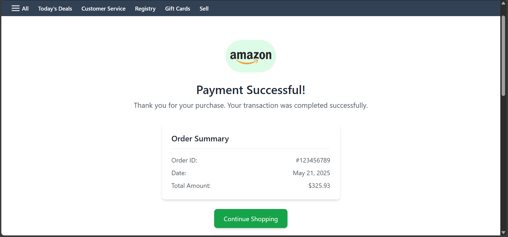
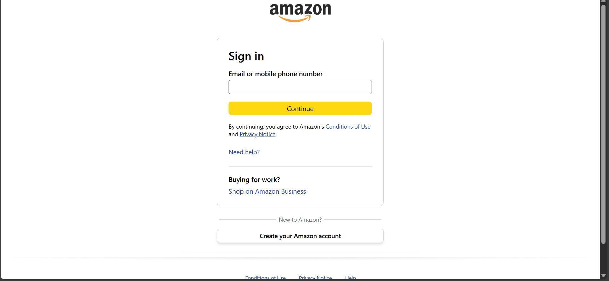
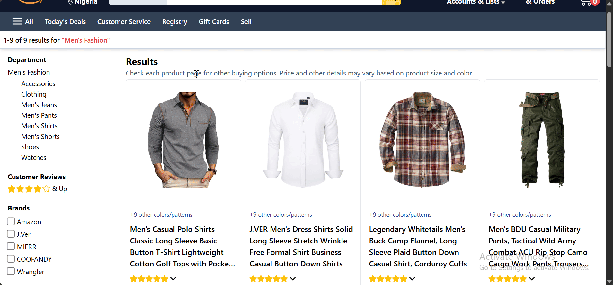
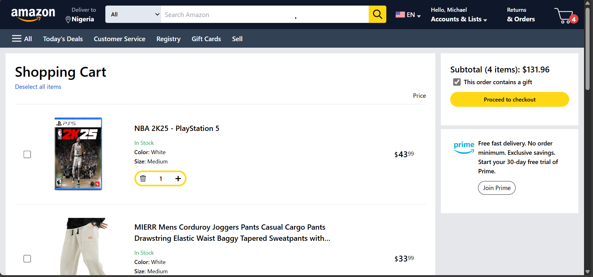

# Amazon Clone

## Project Overview
A feature-rich Amazon clone built using React on the front-end and Django with DRF on the back-end.

## Features Demo

    
    

    
    

    
    

## Technologies Used
### Frontend
- React
- React Router
- Vanilla + Tailwind CSS
- Fetch API
- TailwindCSS
- Vite
### Backend
- Django
- Django Rest Framework
- PostgreSQL
- Stripe
- JWT Authentication